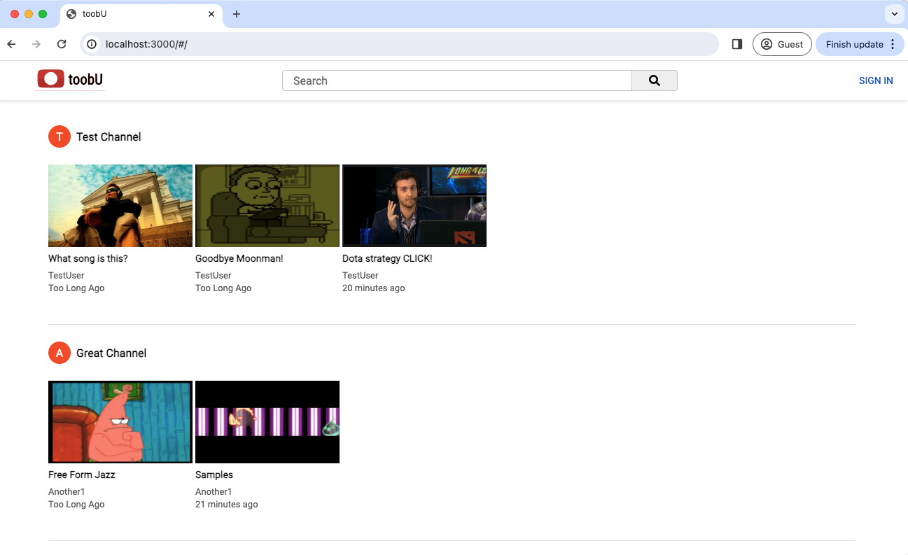
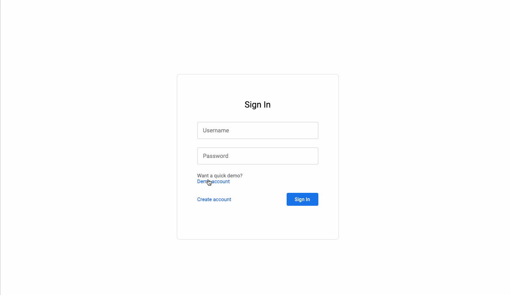
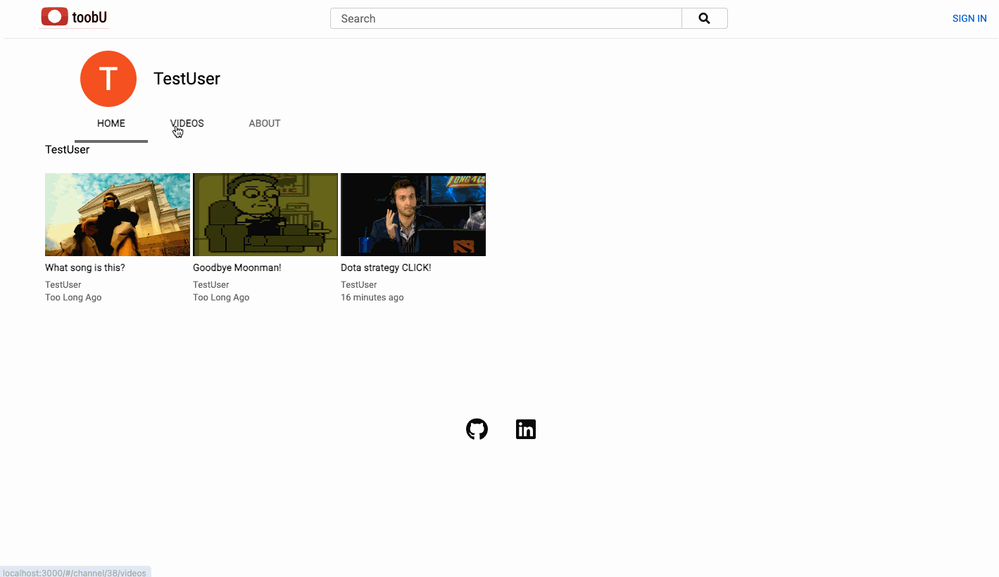
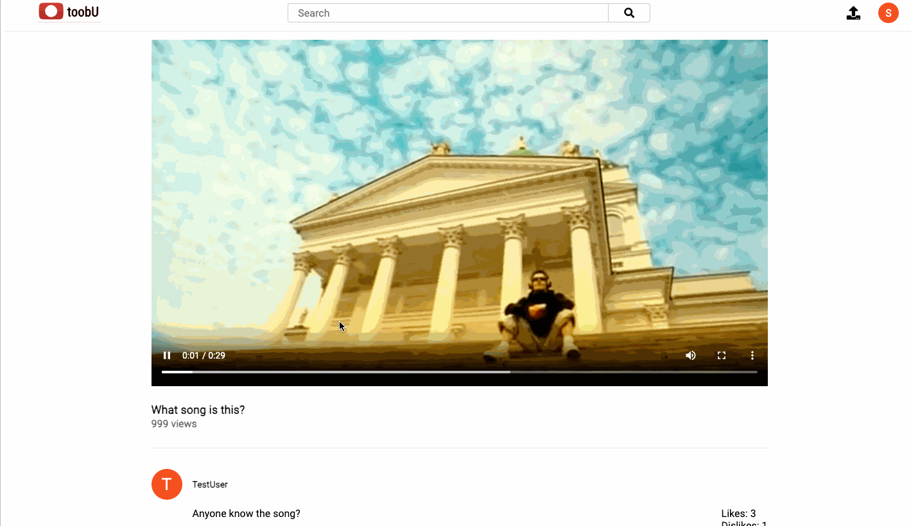

# toobU

### [Design Docs](https://github.com/AdamYLiang/toobU/wiki)

toobU is a YouTube clone that focuses on publicly uploading and sharing videos. Users with an account will have access to a number of features, some of which include creating channels and commenting on videos. 

## Technologies Used
toobU is built with Ruby on a Rails back end and with a React/Redux front end.

toobU uses Amazon Web Services to store videos and other data. 

# Main Features
## User Authentication
Users can signup or login to accounts. In addition there is also a demo account to try out basic features.

## Channels
Once logged in, users can create channels for others to view. 

## Video uploading and view
Once users have channels, they are able to upload videos for others to see and comment on.

## Video searching**
User are able to search and filter for specific videos. 

## Comments and Likes
Logged in users can leave comments and like/dislikes on videos.
 

